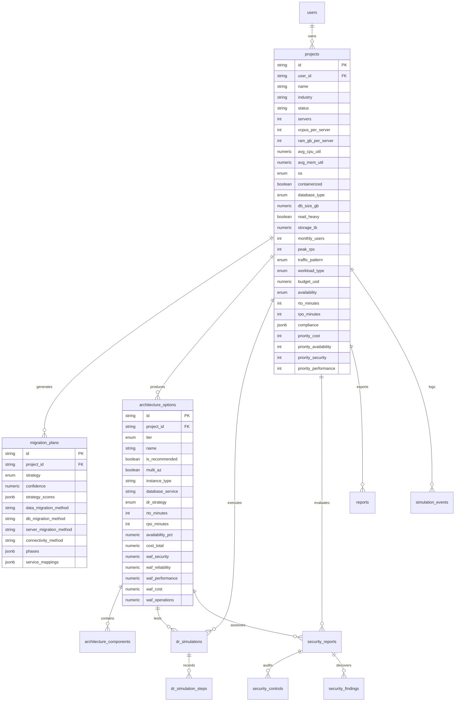

# CloudShift AI — PostgreSQL Database Setup & Integration Guide

This directory contains the complete PostgreSQL database architecture for **CloudShift AI** (*Intelligent Cloud Migration & Disaster Recovery Simulator*), fully aligned with [Project.md](../Project.md) and the React frontend.

---

## 📁 Database Files Overview

| File | Purpose |
|---|---|
| [`schema.sql`](./schema.sql) | DDL: Enums, tables, foreign keys, CHECK constraints, and automated `updated_at` triggers. |
| [`indexes.sql`](./indexes.sql) | Performance B-Tree indexes, foreign key lookup indexes, and GIN indexes for JSONB fields. |
| [`views.sql`](./views.sql) | Analytical views (`v_project_summary`, `v_architecture_comparison`, `v_dr_resilience_matrix`). |
| [`seed.sql`](./seed.sql) | Sample datasets matching the 3 demo projects in the frontend (*RetailCo*, *FinServe*, *MediTrack*). |
| [`init.sql`](./init.sql) | Master execution script chaining all 4 SQL scripts in order. |
| [`docker-compose.yml`](./docker-compose.yml) | One-command local PostgreSQL 16 + pgAdmin 4 environment. |
| [`backend_models.py`](./backend_models.py) | SQLAlchemy 2.0 ORM models & Pydantic v2 schemas for the future Python/FastAPI backend. |
| [`db.py`](./db.py) | Async (`asyncpg`) and Sync (`psycopg2`) database engine and FastAPI `get_db` dependency. |
| [`db-types.ts`](./db-types.ts) | TypeScript interfaces and snake_case <-> camelCase profile converters for Next.js. |

---

## 🏗️ Entity Relationship Diagram (ERD)



---

## 🚀 Setup Options

You can create and populate the database using any of the 4 methods below:

### Option A: Using Docker (Fastest — 1 Command)

If you have Docker Desktop installed:

```bash
cd database
docker compose up -d
```

* **PostgreSQL:** Running on `localhost:5432`
  * Database: `cloudshift_db`
  * Username: `cloudshift_user`
  * Password: `cloudshift_password`
* **pgAdmin UI:** Open browser at `http://localhost:5050`
  * Email: `admin@cloudshift.com`
  * Password: `admin_password`
  * *(The database, tables, indexes, views, and seed data are automatically initialized on startup!)*

---

### Option B: Manual Setup via `psql` (Command Line)

If PostgreSQL is installed locally or on a remote server:

1. **Open your terminal / PowerShell:**
   ```bash
   # Connect to PostgreSQL as superuser
   psql -U postgres
   ```

2. **Create Database & User:**
   ```sql
   CREATE USER cloudshift_user WITH PASSWORD 'cloudshift_password';
   CREATE DATABASE cloudshift_db OWNER cloudshift_user;
   GRANT ALL PRIVILEGES ON DATABASE cloudshift_db TO cloudshift_user;
   \q
   ```

3. **Execute SQL scripts in order:**
   ```bash
   # Navigate to the database folder
   cd d:/VIT/Docs/Sem-5/CAD/Project/Cloud/database

   # Run the scripts
   psql -U cloudshift_user -d cloudshift_db -f schema.sql
   psql -U cloudshift_user -d cloudshift_db -f indexes.sql
   psql -U cloudshift_user -d cloudshift_db -f views.sql
   psql -U cloudshift_user -d cloudshift_db -f seed.sql
   ```

---

### Option C: Manual Setup via pgAdmin (GUI)

1. Open **pgAdmin** and connect to your PostgreSQL server.
2. In the left tree, right-click **Databases** ➔ **Create** ➔ **Database...**
   * Name: `cloudshift_db`
   * Click **Save**.
3. Select `cloudshift_db`, then click **Tools** ➔ **Query Tool** from the top menu.
4. Open and execute each file in this exact sequence (or copy-paste their contents):
   1. [`schema.sql`](./schema.sql) ➔ Click **Execute** (▶ / `F5`)
   2. [`indexes.sql`](./indexes.sql) ➔ Click **Execute** (▶ / `F5`)
   3. [`views.sql`](./views.sql) ➔ Click **Execute** (▶ / `F5`)
   4. [`seed.sql`](./seed.sql) ➔ Click **Execute** (▶ / `F5`)
5. Right-click **Tables** in the left sidebar and click **Refresh**. You will see all 11 tables populated with data.

---

### Option D: Cloud Setup (Amazon RDS / Supabase / Neon)

1. Provision a free PostgreSQL instance on **Supabase**, **Neon.tech**, or **Amazon RDS PostgreSQL**.
2. Copy your Connection URI (e.g. `postgresql://postgres:[PASSWORD]@[HOST]:5432/[DB]`).
3. Open the SQL Editor in the cloud console.
4. Copy and execute [`schema.sql`](./schema.sql), [`indexes.sql`](./indexes.sql), [`views.sql`](./views.sql), and [`seed.sql`](./seed.sql).

---

## 🧪 Verification Queries

To test that everything is working properly, run these queries in your SQL editor:

```sql
-- 1. Check all projects with their recommended architecture and estimated cost
SELECT * FROM v_project_summary;

-- 2. Compare the 3 architectural tiers for RetailCo
SELECT tier, tier_name, cost_total, availability_pct, rto_minutes, waf_average
FROM v_architecture_comparison 
WHERE project_id = 'retailco-erp';

-- 3. Review Disaster Recovery simulation outcomes
SELECT project_name, scenario_title, achieved_rto_min, achieved_rpo_min, recovered_by
FROM v_dr_resilience_matrix;
```

---

## 🔌 Integration Guide

### 1. Connecting Future FastAPI / Python Backend

The backend files [`backend_models.py`](./backend_models.py) and [`db.py`](./db.py) are already set up for FastAPI.

```python
# main.py
from fastapi import FastAPI, Depends
from sqlalchemy.ext.asyncio import AsyncSession
from sqlalchemy import select
from database.db import get_async_db
from database.backend_models import Project, ProjectResponseSchema

app = FastAPI(title="CloudShift AI Backend")

@app.get("/api/projects", response_model=list[ProjectResponseSchema])
async def list_projects(db: AsyncSession = Depends(get_async_db)):
    result = await db.execute(select(Project))
    return result.scalars().all()
```

### 2. Connecting Next.js / TypeScript Frontend

Use [`db-types.ts`](./db-types.ts) to convert between PostgreSQL table records and frontend `InfrastructureProfile` objects.

```typescript
import { mapDBRowToProfile, type DBProjectRow } from '@/database/db-types'
import type { InfrastructureProfile } from '@/lib/types'

// When fetching project from PostgreSQL API or Server Action:
const profile: InfrastructureProfile = mapDBRowToProfile(dbRow)
```
